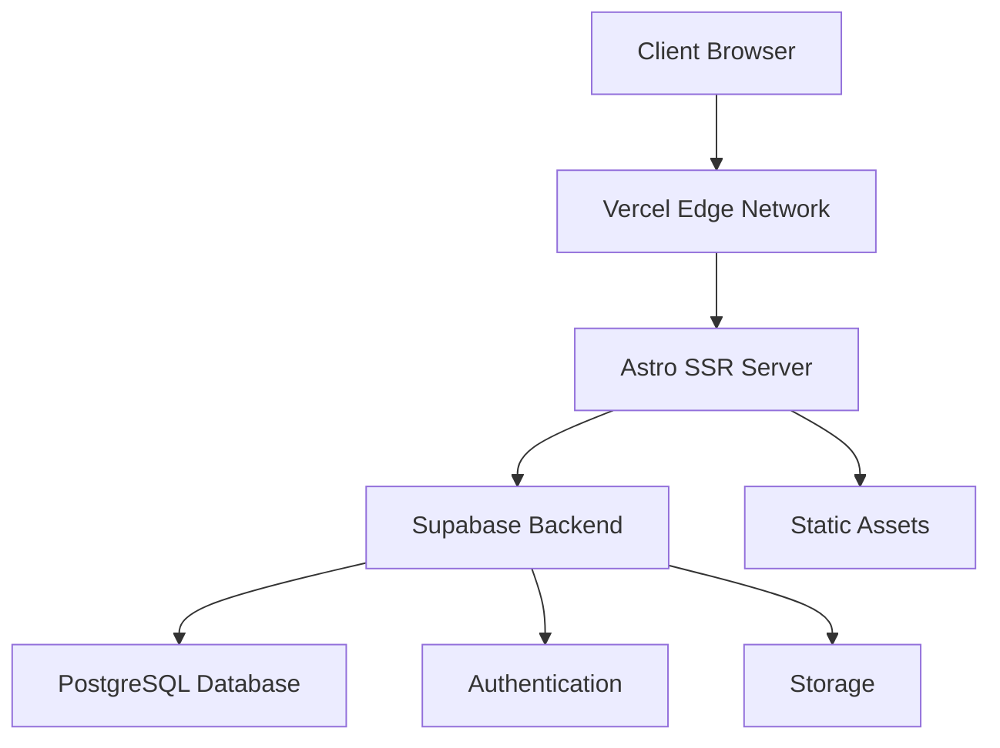
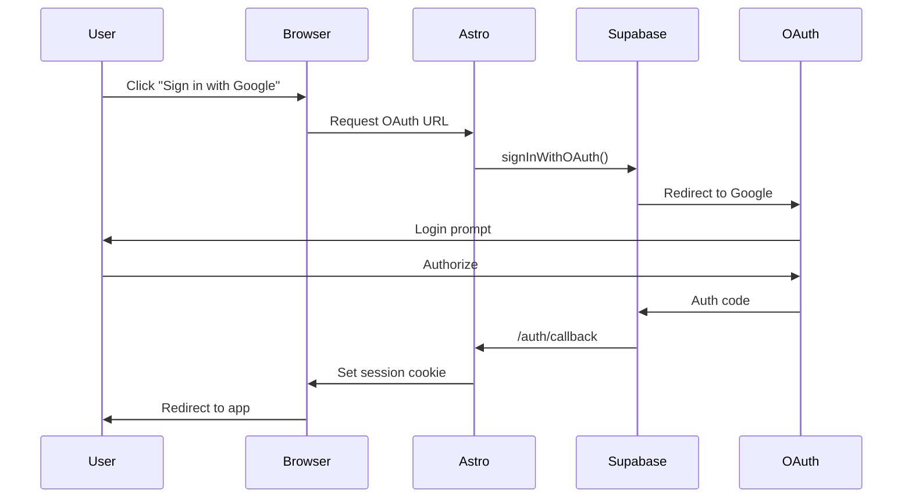

## Overview

The Ayuntamiento de Zongolica platform is built as a modern, server-side rendered (SSR) web application using Astro 5.x as the core framework. The architecture follows a **hybrid approach** combining static site generation with dynamic server-side rendering for optimal performance and flexibility.

## High-Level Architecture

The platform consists of four main layers:



### Frontend Layer

**Astro 5.x Framework**
- Server-side rendering (SSR) enabled via `output: 'server'` configuration
- Partial hydration with React islands for interactive components
- File-based routing in `/src/pages`
- Built-in i18n support for multilingual content (es, en, nah-MX)

**React 19.x Components**
- Interactive UI components using React 19 with `client:*` directives
- Hydrated only when needed for optimal performance
- TypeScript for type safety across all components

### Backend Layer

**Supabase Integration**
- **Authentication**: OAuth providers (Google, Facebook) for user login
- **Database**: PostgreSQL with real-time capabilities
- **Storage**: Asset and media file storage
- **Real-time**: Subscriptions for live data updates

See the [Supabase Integration](/development/supabase) page for detailed database schema.

### Deployment Layer

**Vercel Serverless Platform**
- Configured via `@astrojs/vercel` adapter
- Automatic deployments from Git
- Edge network for global CDN
- Serverless functions for dynamic routes
- Environment variable management

## Request Flow

### Static Page Request

1. User requests a page (e.g., `/comunicacion`)
2. Vercel edge network serves cached HTML if available
3. If not cached, Astro SSR renders the page on-demand
4. Response is cached at the edge for subsequent requests
5. Client receives fully rendered HTML

### Dynamic Page Request (with Auth)

1. User visits `/turismo` (authenticated route)
2. Request hits Vercel serverless function
3. Astro checks for Supabase session cookie
4. If authenticated:
   - Fetches user profile from Supabase
   - Renders personalized content
   - Returns HTML with user-specific data
5. If not authenticated:
   - Redirects to login or shows public content
6. React components hydrate on client for interactivity

### Interactive Component Hydration

```astro
---
// Server-side: runs at build/request time
import MyReactComponent from '@/components/MyComponent.tsx';
---

<!-- Client-side: hydrates when visible -->
<MyReactComponent client:visible />
```

Hydration strategies available:
- `client:load` - Hydrate immediately on page load
- `client:idle` - Hydrate when browser is idle
- `client:visible` - Hydrate when component enters viewport
- `client:only` - Skip SSR, render only on client

## Data Flow

### User Authentication Flow



See [Authentication](/development/authentication) for implementation details.

### Tourism Preferences Flow

1. User completes onboarding wizard
2. `TurismoOnboarding.tsx` collects preferences
3. Data saved to `user_preferences` table via `saveUserPreferences()`
4. Recommendation engine generates personalized route
5. Route saved to `user_routes` table with share code
6. User receives digital ticket with QR code

## File Structure Mapping

```
src/
├── pages/              → Routes (Astro SSR)
├── components/         → UI components (React + Astro)
├── layouts/            → Page templates
├── lib/                → Utilities (supabase.ts)
├── data/               → Static content
├── i18n/               → Translations
└── styles/             → Global CSS

public/                 → Static assets (images, fonts)
```

See [Folder Structure](/development/folder-structure) for detailed breakdown.

## Performance Optimizations

### Server-Side Rendering

- Pages rendered on server for fast First Contentful Paint (FCP)
- HTML delivered immediately, no client-side bundle required for initial render
- SEO-friendly with complete markup

### Partial Hydration

- Only interactive components ship JavaScript to client
- Static content remains HTML-only
- Reduces JavaScript bundle size significantly

### Tailwind CSS 4.x

- Configured via Vite plugin for zero-runtime CSS
- Purged unused styles in production
- Atomic CSS classes for minimal file size

### Image Optimization

- WebP format for modern browsers
- Lazy loading with `loading="lazy"`
- Responsive images with `srcset`

## Internationalization (i18n)

Multilingual support configured in `astro.config.mjs`:

```javascript
i18n: {
  locales: ["es", "en", "nah-MX"],
  defaultLocale: "es",
  routing: {
    prefixDefaultLocale: false,
  },
}
```

- **es**: Spanish (default, no prefix)
- **en**: English (`/en/*`)
- **nah-MX**: Nahuatl (`/nah-MX/*`)

Translations stored in `/src/i18n/xochitlanis/*.json`.

See [Internationalization](/development/i18n) for usage details.

## Security Considerations

### Environment Variables

```bash
PUBLIC_SUPABASE_URL=https://xxx.supabase.co
PUBLIC_SUPABASE_ANON_KEY=eyJxxx...
```

- Public keys safe for client-side use
- Service role keys kept server-side only
- Managed via Vercel environment variables

### Row-Level Security (RLS)

- All Supabase tables protected with RLS policies
- Users can only access their own data
- Authentication required for mutations

### CORS & CSP

- Vercel handles CORS automatically
- Content Security Policy configured for production

## Monitoring & Analytics

<Info>
The platform uses Vercel Analytics for performance monitoring and tracks Core Web Vitals automatically.
</Info>

## Next Steps

<CardGroup cols={2}>
  <Card title="Tech Stack" icon="layer-group" href="/development/tech-stack">
    Explore all technologies and libraries used
  </Card>
  <Card title="Folder Structure" icon="folder-tree" href="/development/folder-structure">
    Navigate the project directory layout
  </Card>
  <Card title="Supabase Integration" icon="database" href="/development/supabase">
    Database schema and helper functions
  </Card>
  <Card title="Authentication" icon="lock" href="/development/authentication">
    Implement user authentication flows
  </Card>
</CardGroup>