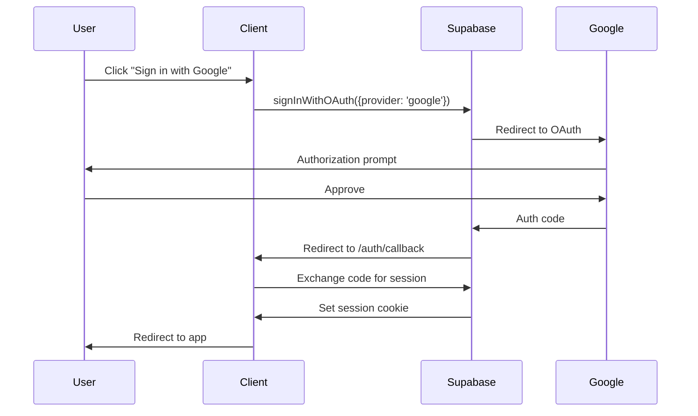

## Overview

The platform uses **Supabase Auth** for user authentication, supporting:
- **OAuth Providers**: Google, Facebook
- **Email/Password**: Traditional authentication
- **Session Management**: Automatic cookie handling
- **Protected Routes**: Server-side auth checks

Authentication UI is handled by the `AuthButtons.tsx` React component.

## Authentication Flow

### OAuth Flow (Google)



## AuthButtons Component

The `AuthButtons.tsx` component provides a complete authentication UI:

```typescript
// src/components/AuthButtons.tsx
import { useState, useEffect } from 'react';
import {
  supabase,
  signInWithEmail,
  signUpWithEmail,
  getCurrentUser,
  signOut
} from '../lib/supabase';

interface AuthButtonsProps {
  onAuthSuccess?: () => void;
}

export default function AuthButtons({ onAuthSuccess }: AuthButtonsProps) {
  const [user, setUser] = useState<any>(null);
  const [loading, setLoading] = useState(true);
  const [isSignUp, setIsSignUp] = useState(false);
  // ...
}
```

### Features

- **Toggle Mode**: Switch between sign in and sign up
- **Form Validation**: Email format, password requirements
- **Loading States**: Visual feedback during async operations
- **Error Handling**: User-friendly error messages
- **Session Persistence**: Listens to auth state changes
- **User Profile Display**: Shows avatar and name when logged in

### Usage in Pages

```astro
---
// pages/turismo.astro
import AuthButtons from '@/components/AuthButtons.tsx';
import { getCurrentUser } from '@/lib/supabase';

const user = await getCurrentUser();
---

{!user ? (
  <div class="max-w-md mx-auto p-6">
    <h2 class="text-2xl font-bold mb-4">Inicia sesión</h2>
    <AuthButtons client:load />
  </div>
) : (
  <p>Bienvenido, {user.user_metadata.name}!</p>
)}
```

## Supabase Auth Functions

### Get Current User

```typescript
import { getCurrentUser } from '@/lib/supabase';

const user = await getCurrentUser();
if (!user) {
  // User not logged in
  return Astro.redirect('/login');
}
```

**Returns**: `User | null`

### Email/Password Sign In

```typescript
import { signInWithEmail } from '@/lib/supabase';

const handleSignIn = async (e: React.FormEvent) => {
  e.preventDefault();
  setError('');
  setLoading(true);

  try {
    const { error } = await signInWithEmail(email, password);
    if (error) throw error;
    // Success - auth state listener will update UI
  } catch (err: any) {
    setError(err.message || 'Error al iniciar sesión');
  } finally {
    setLoading(false);
  }
};
```

**Error Codes**:
- `invalid_credentials` - Wrong email/password
- `email_not_confirmed` - Email verification pending

### Email/Password Sign Up

```typescript
import { signUpWithEmail } from '@/lib/supabase';

const handleSignUp = async (e: React.FormEvent) => {
  e.preventDefault();
  setError('');
  setLoading(true);

  try {
    const { error } = await signUpWithEmail(email, password, name);
    if (error) throw error;
    alert('¡Cuenta creada! Revisa tu email para confirmar tu cuenta.');
  } catch (err: any) {
    setError(err.message || 'Error al crear cuenta');
  } finally {
    setLoading(false);
  }
};
```

**Function Signature**:

```typescript
export async function signUpWithEmail(
  email: string,
  password: string,
  name?: string
) {
  const { data, error } = await supabase.auth.signUp({
    email,
    password,
    options: {
      data: {
        name: name || email.split('@')[0]  // Fallback to email username
      }
    }
  });
  return { data, error };
}
```

### OAuth with Google

```typescript
import { signInWithGoogle } from '@/lib/supabase';

const handleGoogleSignIn = async () => {
  const { error } = await signInWithGoogle('/turismo?onboarding=1');
  if (error) {
    console.error('OAuth error:', error);
  }
  // User will be redirected to Google
};
```

**Implementation**:

```typescript
export async function signInWithGoogle(
  redirectPath = '/turismo?onboarding=1'
) {
  const { data, error } = await supabase.auth.signInWithOAuth({
    provider: 'google',
    options: {
      redirectTo: `${window.location.origin}/auth/callback?return_url=${encodeURIComponent(redirectPath)}`
    }
  });
  return { data, error };
}
```

**Flow**:

1. User clicks "Sign in with Google"
2. `signInWithGoogle()` called with optional redirect path
3. Redirects to Google OAuth consent screen
4. User authorizes
5. Google redirects to `/auth/callback?return_url=/turismo?onboarding=1`
6. Callback page sets session cookie
7. Redirects to `return_url`

### OAuth Callback Handler

```astro
---
// pages/auth/callback.astro
import { supabase } from '@/lib/supabase';

// Exchange code for session
const { searchParams } = Astro.url;
const code = searchParams.get('code');
const returnUrl = searchParams.get('return_url') || '/turismo';

if (code) {
  const { error } = await supabase.auth.exchangeCodeForSession(code);
  if (error) {
    console.error('Session exchange error:', error);
    return Astro.redirect('/error');
  }
}

return Astro.redirect(returnUrl);
---
```

### Sign Out

```typescript
import { signOut } from '@/lib/supabase';

const handleSignOut = async () => {
  setLoading(true);
  await signOut();
  setUser(null);
  setLoading(false);
};
```

**Implementation**:

```typescript
export async function signOut() {
  const { error } = await supabase.auth.signOut();
  return { error };
}
```

## Session Management

### Listen to Auth State Changes

```typescript
useEffect(() => {
  // Get initial session
  getCurrentUser().then(currentUser => {
    setUser(currentUser);
    setLoading(false);
  });

  // Subscribe to auth changes
  const { data: { subscription } } = supabase.auth.onAuthStateChange(
    (_event, session) => {
      setUser(session?.user ?? null);
      if (session?.user && onAuthSuccess) {
        onAuthSuccess();  // Optional callback
      }
    }
  );

  return () => subscription.unsubscribe();
}, []);
```

**Events**:
- `SIGNED_IN` - User logged in
- `SIGNED_OUT` - User logged out
- `TOKEN_REFRESHED` - Session token refreshed
- `USER_UPDATED` - User metadata changed

### Server-Side Auth Check

```astro
---
// pages/turismo/perfil.astro
import { getCurrentUser } from '@/lib/supabase';

const user = await getCurrentUser();

if (!user) {
  return Astro.redirect('/turismo?login=1');
}

const { data: profile } = await getUserProfile(user.id);
---

<h1>Bienvenido, {profile?.full_name}</h1>
```

## Protected Routes Pattern

### Middleware Approach

```typescript
// src/middleware.ts
import { defineMiddleware } from 'astro:middleware';
import { getCurrentUser } from '@/lib/supabase';

export const onRequest = defineMiddleware(async (context, next) => {
  const { pathname } = context.url;

  // Protected routes
  const protectedRoutes = ['/turismo/perfil', '/turismo/mis-rutas'];

  if (protectedRoutes.some(route => pathname.startsWith(route))) {
    const user = await getCurrentUser();
    if (!user) {
      return context.redirect('/turismo?login=1');
    }
  }

  return next();
});
```

### Component-Level Check

```typescript
// components/turismo/MiRutaView.tsx
import { useEffect, useState } from 'react';
import { getCurrentUser } from '@/lib/supabase';

export default function MiRutaView() {
  const [user, setUser] = useState(null);
  const [loading, setLoading] = useState(true);

  useEffect(() => {
    getCurrentUser().then(currentUser => {
      if (!currentUser) {
        window.location.href = '/turismo?login=1';
      }
      setUser(currentUser);
      setLoading(false);
    });
  }, []);

  if (loading) return <div>Cargando...</div>;
  if (!user) return null;

  return <div>Mi ruta privada</div>;
}
```

## User Metadata

Access user information from OAuth providers:

```typescript
const user = await getCurrentUser();

// User object structure
user.id                      // UUID from Supabase
user.email                   // Email address
user.user_metadata.name      // Full name from OAuth
user.user_metadata.avatar_url // Profile picture URL
user.app_metadata.provider   // 'google', 'facebook', 'email'
```

**Display User Info**:

```tsx
{user && (
  <div className="flex items-center gap-3">
    <div className="w-10 h-10 rounded-full bg-orange-500 flex items-center justify-center text-white font-bold">
      {(user.user_metadata?.name || user.email)?.[0]?.toUpperCase()}
    </div>
    <div>
      <p className="text-sm font-semibold text-gray-900">
        {user.user_metadata?.name || user.email?.split('@')[0]}
      </p>
      <p className="text-xs text-gray-500">{user.email}</p>
    </div>
  </div>
)}
```

## AuthButtons Component Reference

### Props

```typescript
interface AuthButtonsProps {
  onAuthSuccess?: () => void;  // Callback after successful login
}
```

### States

- **Unauthenticated**: Shows login/signup form
- **Loading**: Shows spinner during async operations
- **Authenticated**: Shows user profile with logout button

### Form Validation

```tsx
<input
  type="email"
  value={email}
  onChange={(e) => setEmail(e.target.value)}
  placeholder="tu@email.com"
  required
  className="w-full px-4 py-3 rounded-xl border-2 border-gray-300 focus:border-orange-500 focus:outline-none transition"
/>

<input
  type="password"
  value={password}
  onChange={(e) => setPassword(e.target.value)}
  placeholder="••••••••"
  required
  minLength={6}
  className="w-full px-4 py-3 rounded-xl border-2 border-gray-300 focus:border-orange-500 focus:outline-none transition"
/>
```

### Error Handling

```tsx
{error && (
  <div className="bg-red-50 border-2 border-red-200 rounded-xl p-3">
    <p className="text-sm text-red-600">{error}</p>
  </div>
)}
```

### Submit Button States

```tsx
<button
  type="submit"
  disabled={loading}
  className="w-full px-6 py-3 bg-gradient-to-r from-orange-600 to-orange-500 text-white rounded-xl font-bold hover:shadow-lg transition transform hover:-translate-y-0.5 disabled:opacity-50 disabled:cursor-not-allowed"
>
  {loading ? (
    <span className="flex items-center justify-center gap-2">
      <svg className="animate-spin h-5 w-5" viewBox="0 0 24 24">
        {/* Spinner SVG */}
      </svg>
      Procesando...
    </span>
  ) : isSignUp ? (
    'Crear cuenta'
  ) : (
    'Iniciar sesión'
  )}
</button>
```

## Security Considerations

### Environment Variables

<Warning>
**Never commit `.env` files** to version control. Use `PUBLIC_` prefix only for client-safe keys.
</Warning>

```bash
# .env
PUBLIC_SUPABASE_URL=https://xxx.supabase.co
PUBLIC_SUPABASE_ANON_KEY=eyJxxx...  # Safe for client
# SUPABASE_SERVICE_ROLE_KEY=xxx     # Server-only, never PUBLIC_
```

### Row-Level Security

All database operations automatically respect RLS policies:

```sql
-- Users can only access their own data
CREATE POLICY "Users can view own preferences"
ON user_preferences FOR SELECT
USING (auth.uid() = user_id);
```

### CSRF Protection

Supabase handles CSRF tokens automatically in session cookies.

### Password Requirements

- Minimum 6 characters (enforced by input `minLength={6}`)
- Can be customized in Supabase dashboard under Authentication > Policies

## Example: Complete Auth Flow

```astro
---
// pages/turismo.astro
import AuthButtons from '@/components/AuthButtons.tsx';
import TurismoOnboarding from '@/components/turismo/TurismoOnboarding.tsx';
import { getCurrentUser, isOnboardingCompleted } from '@/lib/supabase';

const user = await getCurrentUser();
let showOnboarding = false;

if (user) {
  showOnboarding = !(await isOnboardingCompleted(user.id));
}
---

<!DOCTYPE html>
<html>
<body>
  {!user ? (
    <section class="max-w-md mx-auto p-6 mt-20">
      <h1 class="text-3xl font-bold mb-6">Descubre Zongolica</h1>
      <p class="text-gray-600 mb-8">Inicia sesión para crear tu ruta personalizada</p>
      <AuthButtons
        client:load
        onAuthSuccess={() => window.location.reload()}
      />
    </section>
  ) : showOnboarding ? (
    <TurismoOnboarding client:load />
  ) : (
    <section>
      <h1>Bienvenido, {user.user_metadata.name}!</h1>
      {/* Show personalized content */}
    </section>
  )}
</body>
</html>
```

## Next Steps

<CardGroup cols={2}>
  <Card title="Supabase Integration" icon="database" href="/development/supabase">
    Database schema and helper functions
  </Card>
  <Card title="Tourism Components" icon="map" href="/development/components/tourism">
    TurismoOnboarding and route generation
  </Card>
  <Card title="Architecture" icon="sitemap" href="/development/architecture">
    How authentication fits in the system
  </Card>
  <Card title="Components Overview" icon="puzzle-piece" href="/development/components/overview">
    Building React + Astro components
  </Card>
</CardGroup>