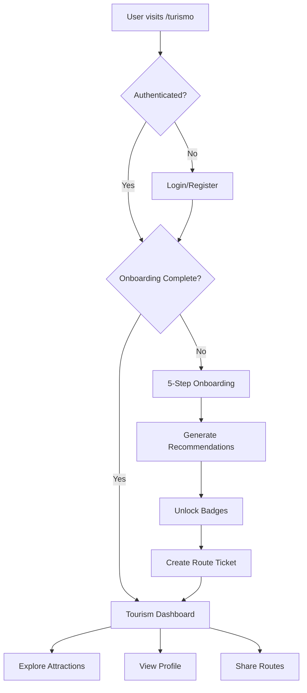

## Overview

The **Xochitlanis Tourism System** is an innovative platform that transforms how visitors discover and explore Zongolica. It combines interactive onboarding, personalized recommendations, and gamification to create engaging tourism experiences.

<Note>
  Named after "Xochitlanis," a Nahuatl term related to flowers and offerings, connecting to the cultural heritage of Zongolica.
</Note>

## System Architecture



## Interactive Onboarding Flow

Location: `/turismo/onboarding.astro`

The onboarding collects user preferences through 5 interactive steps:

### Step 1: Experience Type

**Question:** "What type of experiences do you prefer?"

**Options:**
- 🏔️ Adventure (Aventura)
- 🎭 Culture (Cultura)
- 🌿 Nature (Naturaleza)
- 🍽️ Gastronomy (Gastronomía)
- 🧘 Relaxation (Relajación)

**Data Stored:**
```typescript
experiencia: string[] // Multiple selection allowed
```

### Step 2: Duration

**Question:** "How long will you visit?"

**Options:**
- ⚡ Few hours (2-4 hours)
- 🌅 Half day (4-6 hours)
- ☀️ Full day (8+ hours)
- 🏕️ Multiple days (Weekend)

**Data Stored:**
```typescript
duracion: string // Single selection
```

### Step 3: Difficulty Level

**Question:** "What difficulty level do you prefer?"

**Options:**
- 🟢 Easy - Family friendly
- 🟡 Moderate - Some physical activity
- 🔴 Challenging - Requires good fitness
- ⚫ Extreme - For experienced adventurers

**Data Stored:**
```typescript
dificultad: string // Single selection
```

### Step 4: Travel Group

**Question:** "Who are you traveling with?"

**Options:**
- 👤 Solo
- 💑 Couple
- 👨‍👩‍👧‍👦 Family
- 👥 Friends
- 🎒 Group/Tour

**Data Stored:**
```typescript
grupo: string // Single selection
```

### Step 5: Specific Interests

**Question:** "What interests you most?"

**Options:**
- 💧 Waterfalls
- 🕳️ Caves and sótanos
- 🌄 Viewpoints
- ⛪ Religious sites
- 🏞️ Rivers and pools
- 🏛️ Historical ruins
- 🧗 Extreme sports

**Data Stored:**
```typescript
intereses: string[] // Multiple selection allowed
```

### Database Storage

Preferences are saved to Supabase:

```typescript src/lib/supabase.ts
export interface UserPreferences {
  id?: string;
  user_id: string;
  experiencia: string[];
  duracion: string;
  dificultad: string;
  grupo: string;
  intereses: string[];
  created_at?: string;
}

export async function saveUserPreferences(preferences: UserPreferences) {
  const { data, error } = await supabase
    .from('user_preferences')
    .upsert([preferences], { onConflict: 'user_id' })
    .select()
    .single();
  return { data, error };
}
```

## Personalized Recommendations

Based on user preferences, the system recommends from **17 tourist attractions**:

### Natural Attractions

<AccordionGroup>
  <Accordion title="Cascada Atlahuitzía" icon="droplet">
    **120-meter waterfall**
    
    - Difficulty: Moderate
    - Duration: Half day
    - Best for: Nature lovers, photographers
    - Interests: Waterfalls, hiking
  </Accordion>
  
  <Accordion title="Río Tonto" icon="water">
    **River source in Huixtla**
    
    - Difficulty: Easy
    - Duration: Few hours
    - Best for: Families, relaxation
    - Interests: Rivers, swimming
  </Accordion>
  
  <Accordion title="Cascada El Coxole" icon="droplet">
    **10-meter waterfall with pool**
    
    - Difficulty: Easy
    - Duration: Few hours
    - Best for: Families, swimming
    - Interests: Waterfalls, pools
  </Accordion>
  
  <Accordion title="Río Macuilca" icon="waves">
    **Crystal-clear river**
    
    - Difficulty: Easy
    - Duration: Half day
    - Best for: Families, nature
    - Interests: Rivers, relaxation
  </Accordion>
</AccordionGroup>

### Adventure Attractions

<AccordionGroup>
  <Accordion title="Sótano del Popócatl" icon="circle">
    **70-meter vertical cave descent**
    
    - Difficulty: Extreme
    - Duration: Full day
    - Best for: Experienced adventurers
    - Interests: Caves, extreme sports, rappelling
  </Accordion>
  
  <Accordion title="Sótano del Gachupín" icon="climbing">
    **90-meter rappel descent**
    
    - Difficulty: Extreme
    - Duration: Full day
    - Best for: Adventure seekers
    - Interests: Caves, rappelling, extreme sports
  </Accordion>
  
  <Accordion title="Cueva Chicomeatl" icon="moon">
    **400-meter cave exploration**
    
    - Difficulty: Moderate-Challenging
    - Duration: Half day
    - Best for: Adventurers, spelunkers
    - Interests: Caves, exploration
  </Accordion>
</AccordionGroup>

### Cultural & Religious Sites

<AccordionGroup>
  <Accordion title="Parroquia San Francisco de Asís" icon="church">
    **Colonial parish with "Señor del Recuerdo"**
    
    - Difficulty: Easy
    - Duration: 1-2 hours
    - Best for: Cultural tourism, religious pilgrimage
    - Interests: Religious sites, history
  </Accordion>
  
  <Accordion title="El Calvario" icon="monument">
    **Franciscan temple from 1567**
    
    - Difficulty: Easy
    - Duration: 1-2 hours
    - Best for: History enthusiasts
    - Interests: Religious sites, colonial architecture
  </Accordion>
  
  <Accordion title="La Pérgola" icon="church">
    **Chapel on Tlaltiticuinco hill**
    
    - Difficulty: Moderate (uphill walk)
    - Duration: 2-3 hours
    - Best for: Religious tourism, viewpoints
    - Interests: Religious sites, views
  </Accordion>
</AccordionGroup>

### Viewpoints

<AccordionGroup>
  <Accordion title="Mirador El Precipicio" icon="mountain">
    **200-meter cliff viewpoint**
    
    - Difficulty: Moderate
    - Duration: Half day
    - Best for: Photography, nature
    - Interests: Viewpoints, panoramas
  </Accordion>
  
  <Accordion title="Estatua Cristo Rey" icon="cross">
    **Macuilxóchitl hill summit**
    
    - Difficulty: Moderate
    - Duration: 2-3 hours
    - Best for: Viewpoints, photography
    - Interests: Religious sites, views
  </Accordion>
</AccordionGroup>

## Badge Gamification System

Location: `src/lib/badges.ts`

The platform includes a comprehensive badge system with **29 unique achievements**.

### Badge Categories

#### Onboarding Badge

```typescript
perfil_creado: {
  id: 'perfil_creado',
  name: 'Aventurero',
  description: '¡Creaste tu perfil de viajero!',
  icon: '🎒',
  color: 'from-emerald-500 to-teal-500',
  unlockType: 'onboarding'
}
```

Unlocked when user completes profile creation.

#### Action-Based Badges

**Favorites:**

```typescript
primer_favorito: {
  id: 'primer_favorito',
  name: 'Primer Favorito',
  description: '¡Guardaste tu primer lugar especial!',
  icon: '❤️',
  color: 'from-rose-400 to-pink-500',
  unlockType: 'action',
  actionCount: 1
}

coleccionista: {
  id: 'coleccionista',
  name: 'Coleccionista',
  description: 'Has guardado 5 lugares favoritos',
  icon: '💎',
  color: 'from-violet-500 to-purple-600',
  unlockType: 'action',
  actionCount: 5
}
```

**Exploration:**

```typescript
expplorador_5: {
  id: 'explorador_5',
  name: 'Explorador',
  description: 'Visitaste 5 lugares de la Sierra',
  icon: '🧭',
  color: 'from-amber-500 to-orange-500',
  unlockType: 'action',
  actionCount: 5
}

leyenda: {
  id: 'leyenda',
  name: 'Leyenda de Zongolica',
  description: '¡Visitaste los 17 atractivos!',
  icon: '👑',
  color: 'from-amber-300 to-yellow-500',
  unlockType: 'action',
  actionCount: 17
}
```

#### Visit-Based Badges (17 Attractions)

Each attraction has a dedicated badge:

```typescript
visit_atlahuitzia: {
  id: 'visit_atlahuitzia',
  name: 'Cascada Atlahuitzía',
  description: 'Contemplaste la cascada de 120 metros',
  icon: '💧',
  color: 'from-cyan-500 to-blue-500',
  unlockType: 'visit',
  atractivoSlug: 'cascada-atlahuitzia'
}
```

Complete list of attraction badges:
- 💧 Cascada Atlahuitzía
- 🛶 Río Tonto
- 🕳️ Sótano del Popócatl
- 🦇 Cueva Chicomeatl
- 🏊 Cascada El Coxole
- 🏔️ Arco Natural Boquerón
- 🐦 Cueva de las Golondrinas
- 🏚️ Exhacienda de los Gachupines
- 🧗 Sótano del Gachupín
- 🌄 Mirador El Precipicio
- ⛰️ Perfil del Cristo
- 🕯️ Cueva de Totomochapa
- 🏞️ Río Macuilca
- ⛪ La Pérgola
- 🏛️ El Calvario
- 🙏 Parroquia San Francisco
- ✝️ Estatua Cristo Rey

#### Purchase-Based Badges

```typescript
primer_paquete: {
  id: 'primer_paquete',
  name: 'Primer Paquete',
  description: '¡Compraste tu primer paquete turístico!',
  icon: '🎫',
  color: 'from-teal-500 to-emerald-500',
  unlockType: 'purchase'
}
```

### Badge Storage

Badges are tracked in Supabase:

```typescript
export async function saveUserBadge(userId: string, badgeType: string) {
  const { data, error } = await supabase
    .from('user_badges')
    .insert([{ user_id: userId, badge_type: badgeType }])
    .select()
    .single();
  return { data, error };
}
```

## Ticket Generation and Sharing

After onboarding, users receive a personalized route ticket:

### Ticket Components

- **User name and profile**
- **Route name** (generated from preferences)
- **Recommended attractions** (personalized list)
- **Unlocked badges** (visual icons)
- **Share code** (unique identifier)
- **QR code** (for easy sharing)
- **Social media sharing** (Facebook, Twitter, WhatsApp)

### Route Storage

```typescript src/lib/supabase.ts
export interface UserRoute {
  id: string;
  user_id: string;
  user_name?: string;
  route_name: string;
  atractivos: string[]; // Attraction slugs
  ticket_url: string;
  share_code: string; // Unique shareable code
  badges: string[]; // Unlocked badge IDs
  created_at: string;
}

export async function saveUserRoute(route: Omit<UserRoute, 'id' | 'created_at'>) {
  const { data, error } = await supabase
    .from('user_routes')
    .insert([route])
    .select()
    .single();
  return { data, error };
}
```

### Share Code System

Unique codes are generated using `nanoid`:

```typescript
import { nanoid } from 'nanoid';

const shareCode = nanoid(10); // e.g., "abc123xyz7"
```

### Shared Route Pages

Location: `/ruta/[code].astro`

Public pages showing shared routes:

```astro
---
export const prerender = false;

const { code } = Astro.params;
const route = await getUserRoute(code);
---

<Layout title={`Ruta: ${route.route_name}`}>
  <!-- Display route details -->
</Layout>
```

## User Profile System

Location: `/turismo/perfil.astro`

### Profile Data

```typescript
export interface UserProfile {
  id: string;
  email: string;
  full_name: string;
  avatar_url: string;
  provider: string; // 'google', 'facebook', 'email'
  onboarding_completed: boolean;
  created_at: string;
  updated_at: string;
}
```

### Profile Features

<CardGroup cols={2}>
  <Card title="Personal Info" icon="user">
    Name, email, avatar, and account settings
  </Card>
  
  <Card title="Saved Routes" icon="route">
    History of generated personalized routes
  </Card>
  
  <Card title="Badge Collection" icon="medal">
    Display all unlocked achievements
  </Card>
  
  <Card title="Favorites" icon="heart">
    Saved attractions for future visits
  </Card>
</CardGroup>

## Favorites System

### Adding Favorites

```typescript src/lib/supabase.ts
export async function addFavorite(userId: string, atractivoSlug: string) {
  const { data, error } = await supabase
    .from('user_favorites')
    .insert([{ user_id: userId, atractivo_slug: atractivoSlug }])
    .select()
    .single();
  return { data, error };
}

export async function toggleFavorite(userId: string, atractivoSlug: string): Promise<boolean> {
  const isFav = await isFavorite(userId, atractivoSlug);
  if (isFav) {
    await removeFavorite(userId, atractivoSlug);
    return false;
  } else {
    await addFavorite(userId, atractivoSlug);
    return true;
  }
}
```

## Tourism Pages

### Main Tourism Hub

Location: `/turismo/index.astro`

Features:
- Call-to-action to start onboarding
- Featured attractions grid
- Recent shared routes
- Tourism statistics

### Attractions Index

Location: `/turismo/atractivos/index.astro`

Browse all 17 attractions with:
- Filterable grid
- Search functionality
- Category tabs
- Difficulty indicators

### Attraction Detail Pages

Location: `/turismo/atractivos/[slug].astro`

Dynamic pages for each attraction:
- Photo gallery
- Description and details
- Location map
- Difficulty and duration
- Related badge
- "Add to Favorites" button
- Similar attractions

### Route Planner

Location: `/turismo/planificador.astro`

Interactive tool to:
- Build custom routes
- Estimate duration
- Calculate distances
- Export to Google Maps

## Social Sharing

Integrated sharing for routes:

```typescript
// Facebook
const facebookUrl = `https://www.facebook.com/sharer/sharer.php?u=${encodeURIComponent(shareUrl)}`;

// Twitter
const twitterUrl = `https://twitter.com/intent/tweet?url=${encodeURIComponent(shareUrl)}&text=${encodeURIComponent(text)}`;

// WhatsApp
const whatsappUrl = `https://wa.me/?text=${encodeURIComponent(text + ' ' + shareUrl)}`;

// Native Web Share API
if (navigator.share) {
  await navigator.share({
    title: route.route_name,
    text: description,
    url: shareUrl
  });
}
```

## Next Steps

<CardGroup cols={2}>
  <Card title="Authentication System" icon="lock" href="/features/authentication">
    Learn how user authentication works
  </Card>
  <Card title="Multilingual Support" icon="language" href="/features/multilingual">
    Manage translations for the tourism system
  </Card>
</CardGroup>