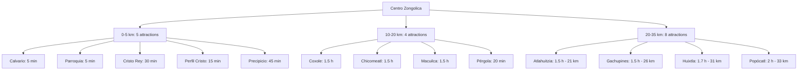

# 17 Tourist Attractions in Zongolica

Zongolica offers **17 official tourist attractions** ranging from colonial architecture to extreme adventure caves and waterfalls. All data is maintained in `src/data/turismo/lugares.ts`.

<Note>
  Source: Tourist Guide from the Tourism Department, H. Ayuntamiento de Zongolica  
  Responsible: Ing. Arturo Zavaleta García
</Note>

## Attraction Interface

```typescript src/types/turismo.ts
export interface Atractivo {
  slug: string;
  titulo: string;
  subtitulo: string;
  descripcionCorta: string;
  descripcionLarga: string[];
  imagen: string;
  galeria?: string[];
  categoria: 'Arquitectura' | 'Cascadas' | 'Naturaleza' | 'Miradores';
  ubicacion: string;
  coordenadas?: { lat: number; lng: number };
  horarios: { titulo: string; items: string[] }[];
  costos?: { titulo: string; items: string[] }[];
  stats: { label: string; value: string; icon?: string }[];
  cta: { label: string; href: string };
  duracionSugerida: string;
  dificultad: 'Baja' | 'Media' | 'Alta';
  recomendaciones: string[];
  seguridadTips: string[];
  queTraer?: string[];
  mejorEpoca?: string;
  accesibilidad: {
    sillasRuedas: boolean;
    estacionamiento: boolean;
    sanitarios: boolean;
    señalizacion: boolean;
    guiaAdaptada: boolean;
    notas: string;
  };
  ultimaActualizacion: string;
  destacado: boolean;
  familiaFriendly: boolean;
}
```

## Categories

Attractions are organized into 4 main categories:

<CardGroup cols={2}>
  <Card title="Arquitectura" icon="landmark">
    Religious and historical buildings (4 attractions)
  </Card>
  <Card title="Cascadas" icon="water">
    Waterfalls and water features (2 attractions)
  </Card>
  <Card title="Naturaleza" icon="tree">
    Caves, caves, rivers, formations (9 attractions)
  </Card>
  <Card title="Miradores" icon="binoculars">
    Viewpoints and overlooks (2 attractions)
  </Card>
</CardGroup>

## Religious & Historical Architecture (4)

### 1. La Pérgola

```typescript src/data/turismo/lugares.ts
{
  slug: "la-pergola",
  titulo: "La Pérgola",
  subtitulo: "Capilla y mirador en el cerro Tlaltiticuinco",
  descripcionCorta: "Estructura arquitectónica de 1957 ubicada en lo alto del cerro Tlaltiticuinco, dedicada a la Virgen María de Guadalupe.",
  categoria: "Arquitectura",
  ubicacion: "Cerro Tlaltiticuinco, Zongolica, Veracruz",
  duracionSugerida: "1-2 horas",
  dificultad: "Media",
  stats: [
    { label: "Año", value: "1957", icon: "🏛️" },
    { label: "Tipo", value: "Capilla", icon: "⛪" },
    { label: "Zona", value: "Cerro", icon: "⛰️" },
  ],
  recomendaciones: [
    "Lleva calzado cómodo para la subida",
    "Aprovecha para tomar fotografías panorámicas",
    "Visita el 12 de marzo para la celebración anual",
  ],
  destacado: false,
  familiaFriendly: true,
}
```

- **Year**: 1957
- **Access**: 20 min by car, 50 min walking
- **Best time**: March 12 (annual celebration)

### 2. El Calvario

```typescript src/data/turismo/lugares.ts
{
  slug: "el-calvario",
  titulo: "El Calvario",
  subtitulo: "Templo franciscano de 1567 con arquitectura única",
  descripcionCorta: "Templo edificado por frailes franciscanos en 1567, con capiteles ornamentados con figuras de hongos disimulados.",
  categoria: "Arquitectura",
  duracionSugerida: "30-60 minutos",
  dificultad: "Baja",
  destacado: true,
  familiaFriendly: true,
}
```

- **Year**: 1567 (oldest in region)
- **Styles**: Colonial, Romanesque, Gothic, Renaissance, Neoclassical
- **Unique feature**: Hidden mushroom ornaments on capitals
- **Accessibility**: Wheelchair accessible

### 3. Parroquia San Francisco de Asís

```typescript src/data/turismo/lugares.ts
{
  slug: "parroquia-san-francisco-de-asis",
  titulo: "Parroquia San Francisco de Asís y El Señor del Recuerdo",
  subtitulo: "Tres etapas de construcción (1571 – 1727 – 1818) y una leyenda centenaria",
  categoria: "Arquitectura",
  coordenadas: { lat: 18.665, lng: -97.0097 },
  horarios: [
    {
      titulo: "Horario de visita",
      items: [
        "Lunes a Viernes: 7:00 - 19:00",
        "Sábado y Domingo: 6:00 - 20:00",
      ],
    },
  ],
  stats: [
    { label: "Época", value: "1571-1818", icon: "🏛️" },
    { label: "Estilo", value: "Barroco", icon: "⛪" },
    { label: "Murales", value: "8", icon: "🎨" },
  ],
  destacado: true,
}
```

- **Construction**: 3 phases (1571, 1727, 1818)
- **Artist**: Elvira Gascón (8 murals over 8 years)
- **Legend**: El Señor del Recuerdo found in 1812
- **Schedule**: Mon-Fri 7am-7pm, Sat-Sun 6am-8pm

### 4. Estatua del Cristo Rey

```typescript src/data/turismo/lugares.ts
{
  slug: "estatua-cristo-rey",
  titulo: "Estatua del Cristo Rey",
  subtitulo: "Mirador de 12 metros en el cerro Macuilxóchitl",
  duracionSugerida: "1-2 horas",
  dificultad: "Media",
  stats: [
    { label: "Altura", value: "12 m", icon: "📏" },
    { label: "Año", value: "1949", icon: "🏛️" },
    { label: "Material", value: "Cantera", icon: "🪨" },
  ],
  destacado: true,
}
```

- **Height**: 12 meters
- **Year**: 1949
- **Material**: Cantera from Tehuacán quarries
- **Access**: 30 min walk from downtown

## Waterfalls (2)

### 5. Cascada Atlahuitzía

```typescript src/data/turismo/lugares.ts
{
  slug: "cascada-atlahuitzia",
  titulo: "Cascada Atlahuitzía",
  subtitulo: "Impresionante caída de agua de 120 metros",
  categoria: "Cascadas",
  ubicacion: "Tepetlampa, congregación Zapaltécatl, Zongolica, Veracruz",
  duracionSugerida: "4-5 horas (tour completo)",
  dificultad: "Media",
  stats: [
    { label: "Altura", value: "120 m", icon: "📏" },
    { label: "Distancia", value: "21 km", icon: "🚗" },
    { label: "Duración", value: "4-5 h", icon: "⏱️" },
  ],
  costos: [
    {
      titulo: "Paquete turístico (Ruta 3)",
      items: [
        "Tour completo: $500 MXN por persona",
        "Incluye: transporte, guías, snack, equipo acuático",
        "Incluye visita al Mirador del Precipicio",
      ],
    },
  ],
  destacado: true,
}
```

- **Height**: 120 meters
- **Distance**: 21 km (~1.5 hours)
- **Package**: $500 MXN (Route 3)
- **Best season**: November to May

### 9. Cascada El Coxole

- **Height**: 7 meters
- **Pool depth**: 10 meters
- **Location**: Puente Porras (12 km)
- **Difficulty**: Medium
- **Family friendly**: Yes

## Natural Caves & Sótanos (5)

### 6. Nacimiento del Río Tonto

```typescript src/data/turismo/lugares.ts
{
  slug: "nacimiento-rio-tonto",
  titulo: "Nacimiento del Río Tonto",
  subtitulo: "Espeleísmo y kayak en Huixtla",
  categoria: "Naturaleza",
  duracionSugerida: "4-8 horas (tour completo)",
  dificultad: "Alta",
  stats: [
    { label: "Profundidad", value: "15-30 m", icon: "📏" },
    { label: "Kayak", value: "3.5 km", icon: "🛶" },
    { label: "Balsa", value: "480 m", icon: "🚣" },
  ],
  costos: [
    {
      titulo: "Paquete turístico (Ruta 1: Tour Huixtla)",
      items: [
        "Tour básico: $750 MXN por persona",
        "Extra espeleísmo: $500 MXN",
        "Extra kayak: $500 MXN",
      ],
    },
  ],
  destacado: true,
}
```

- **Depth**: 15-30 meters
- **Activities**: Caving, kayaking (3.5 km), boat ride (480 m)
- **Package**: $750 + optional extras
- **Route 1**: Tour Huixtla

### 7. Sótano del Popócatl

- **Depth**: 70 meters
- **Feature**: Waterfall inside creating underground river
- **Package**: $1,350 MXN (Route 2)
- **Difficulty**: High
- **Family friendly**: No (16+ only)

### 8. Cueva Chicomeatl

- **Depth**: 400 meters horizontal
- **Location**: Zacatal Grande (13 km)
- **Difficulty**: High
- **Requires**: Certified speleology guide

### 11. Cueva de las Golondrinas

- **Height**: 60 meters
- **Feature**: Swallow colonies
- **Best time**: Dawn/dusk for bird watching
- **Location**: El Porvenir (26 km)

### 13. Sótano del Gachupín

- **Depth**: 90 meters vertical
- **Activity**: Rappelling
- **Difficulty**: High
- **Requires**: Experience recommended

### 16. Cueva de Totomochapa

- **Height**: 40 meters
- **Depth**: 50 meters horizontal
- **Part of**: Route 2 (Sótano Popócatl tour)

## Natural Formations (4)

### 10. Arco Natural El Boquerón

```typescript src/data/turismo/lugares.ts
{
  slug: "arco-natural-boqueron",
  titulo: "Arco Natural El Boquerón",
  subtitulo: "Formación natural de 180 metros de altura",
  categoria: "Naturaleza",
  stats: [
    { label: "Altura", value: "180 m", icon: "📏" },
    { label: "Distancia", value: "30 km", icon: "🚗" },
    { label: "Tipo", value: "Formación", icon: "🏔️" },
  ],
  destacado: true,
}
```

- **Height**: 180 meters
- **Formation**: Millions of years of limestone erosion
- **Part of**: Route 1 (Tour Huixtla)

### 12. Exhacienda de los Gachupines

- **Type**: Colonial ruins
- **Location**: El Porvenir (26 km)
- **Historical**: Spanish colonial period
- **Combine with**: Cueva Golondrinas + Sótano Gachupín

### 15. Perfil del Cristo

- **Type**: Rock formation resembling Christ profile
- **Distance**: 3 km (15 min)
- **Difficulty**: Low
- **Part of**: Routes 1 & 2

### 17. Río Macuilca

- **Type**: Crystal-clear river
- **Location**: Macuilcal (15 km)
- **Activities**: Picnic, nature observation
- **Best season**: November to May

## Viewpoints (2)

### 14. Mirador El Precipicio

```typescript src/data/turismo/lugares.ts
{
  slug: "mirador-el-precipicio",
  titulo: "Mirador El Precipicio",
  subtitulo: "200 metros de altura entre Apanga y Xochitla",
  categoria: "Miradores",
  stats: [
    { label: "Altura", value: "200 m", icon: "📏" },
    { label: "Distancia", value: "5 km", icon: "🚗" },
    { label: "Vista", value: "Panorámica", icon: "👁️" },
  ],
  destacado: true,
}
```

- **Height**: 200 meters
- **Distance**: 5 km (45 min)
- **Best time**: Morning (clear skies)
- **Part of**: Route 3 (Cascada Atlahuitzía)

## Difficulty Levels

<Tabs>
  <Tab title="Baja (Low)">
    - El Calvario
    - Parroquia San Francisco
    - Perfil del Cristo
    - Mirador El Precipicio
    - Exhacienda Gachupines
    
    Suitable for all ages, accessible, no special equipment needed.
  </Tab>
  
  <Tab title="Media (Medium)">
    - La Pérgola
    - Cristo Rey
    - Cascada Atlahuitzía
    - Cascada El Coxole
    - Arco Natural Boquerón
    - Río Macuilca
    - Cueva Golondrinas
    - Cueva Totomochapa
    
    Moderate fitness required, some hiking, guided tour recommended.
  </Tab>
  
  <Tab title="Alta (High)">
    - Nacimiento Río Tonto
    - Sótano del Popócatl
    - Cueva Chicomeatl
    - Sótano del Gachupín
    
    Excellent fitness, specialized equipment, certified guides mandatory, 16+ years.
  </Tab>
</Tabs>

## Distance from Downtown



## Accessibility Features

| Attraction | Wheelchair | Parking | Restrooms | Signage |
|------------|------------|---------|-----------|----------|
| El Calvario | ✅ | ✅ | ❌ | ✅ |
| Parroquia | ✅ | ✅ | ✅ | ✅ |
| Cristo Rey | ❌ | ❌ | ❌ | ✅ |
| Precipicio | ❌ | ✅ | ❌ | ✅ |
| Atlahuitzia | ❌ | ✅ | ❌ | ✅ |
| Others | ❌ | Varies | ❌ | Varies |

<Note>
  Most natural attractions require moderate hiking and are not wheelchair accessible.
</Note>

## Query Attractions

```typescript
import { atractivos } from '@/data/turismo/lugares';

// Get all attractions
const all = atractivos; // 17 attractions

// Filter by category
const waterfalls = atractivos.filter(a => a.categoria === 'Cascadas');

// Filter by difficulty
const easy = atractivos.filter(a => a.dificultad === 'Baja');

// Get featured
const featured = atractivos.filter(a => a.destacado);

// Family friendly
const family = atractivos.filter(a => a.familiaFriendly);

// By slug
const attraction = atractivos.find(a => a.slug === 'cascada-atlahuitzia');
```

## Related Pages

<CardGroup cols={2}>
  <Card title="Routes" icon="route" href="/tourism/routes">
    Official and user-created routes
  </Card>
  <Card title="Badges" icon="award" href="/tourism/badges">
    17 visit badges, one per attraction
  </Card>
  <Card title="Recommendations" icon="sparkles" href="/tourism/recommendations">
    Xochitlanis AI recommendations
  </Card>
  <Card title="Tickets" icon="ticket" href="/tourism/tickets">
    Generate shareable tickets
  </Card>
</CardGroup>