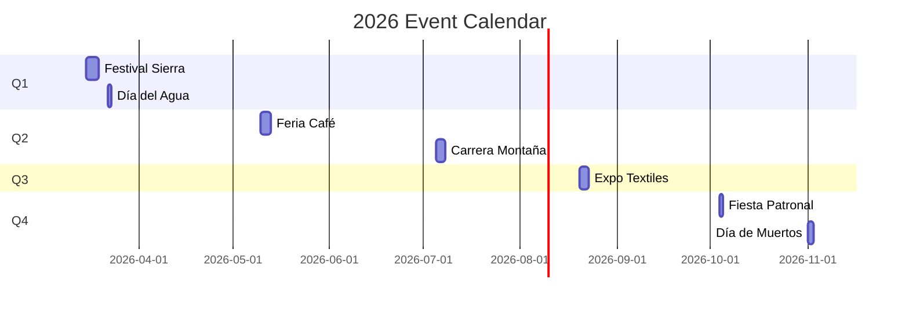

# Tourism Events Calendar

The Zongolica Tourism platform features a comprehensive **events calendar** with festivals, cultural celebrations, sports competitions, and gastronomic fairs throughout the year.

<Note>
  Events data is defined in `src/data/turismo/index.ts` with 7 major annual events.
</Note>

## Event Interface

```typescript src/types/turismo.ts
export interface EventoTuristico {
  id: string;
  nombre: string;
  fecha: string;              // ISO date: "2026-03-15"
  fechaFin?: string;          // Optional end date
  tipo: string;               // Event type/category
  descripcion: string;
  ubicacion: string;
  icono: string;              // Emoji icon
  color: string;              // Tailwind color class
  destacado: boolean;         // Featured event
}
```

## Event Categories

<CardGroup cols={2}>
  <Card title="Cultural" icon="masks-theater">
    Festivals, traditional dances, exhibitions
  </Card>
  <Card title="Religious" icon="church">
    Patron saint celebrations, processions
  </Card>
  <Card title="Gastronomy" icon="utensils">
    Food fairs, coffee festivals, local products
  </Card>
  <Card title="Sports" icon="person-running">
    Mountain races, trail running, competitions
  </Card>
  <Card title="Artistic" icon="palette">
    Artisan exhibitions, textile shows
  </Card>
  <Card title="Ecological" icon="leaf">
    Environmental awareness, clean-up campaigns
  </Card>
</CardGroup>

## Annual Events (7)

### 1. Festival de la Sierra

```typescript src/data/turismo/index.ts
{
  id: "1",
  nombre: "Festival de la Sierra",
  fecha: "2026-03-15",
  fechaFin: "2026-03-18",
  tipo: "Cultural",
  descripcion: "Gran celebración de música, danza y gastronomía tradicional nahua con artistas locales y regionales.",
  ubicacion: "Plaza Principal, Zongolica",
  icono: "🎭",
  color: "bg-purple-500",
  destacado: true,
}
```

- **Dates**: March 15-18
- **Duration**: 4 days
- **Activities**: Music, traditional dance, local food
- **Location**: Main Plaza
- **Featured**: Yes

### 2. Día Mundial del Agua

```typescript src/data/turismo/index.ts
{
  id: "2",
  nombre: "Día Mundial del Agua",
  fecha: "2026-03-22",
  tipo: "Ecológico",
  descripcion: "Actividades de concientización, limpieza de ríos y caminata ecológica a cascadas.",
  ubicacion: "Cascada de Atlahuitzía",
  icono: "💧",
  color: "bg-blue-500",
  destacado: false,
}
```

- **Date**: March 22 (World Water Day)
- **Activities**: River cleanup, eco-hike to waterfalls
- **Type**: Ecological awareness
- **Location**: Cascada Atlahuitzía

### 3. Feria Regional del Café

```typescript src/data/turismo/index.ts
{
  id: "3",
  nombre: "Feria Regional del Café",
  fecha: "2026-05-10",
  fechaFin: "2026-05-12",
  tipo: "Gastronómico",
  descripcion: "Expo-venta de café de altura, cata profesional, talleres de barismo y productos regionales.",
  ubicacion: "Centro de Zongolica",
  icono: "☕",
  color: "bg-amber-600",
  destacado: true,
}
```

- **Dates**: May 10-12
- **Duration**: 3 days
- **Activities**: Coffee tasting, barista workshops, regional products
- **Type**: Gastronomic fair
- **Featured**: Yes

### 4. Carrera de Montaña Sierra Zongolica

```typescript src/data/turismo/index.ts
{
  id: "4",
  nombre: "Carrera de Montaña Sierra Zongolica",
  fecha: "2026-07-05",
  fechaFin: "2026-07-07",
  tipo: "Deportivo",
  descripcion: "Competencia de trail running con categorías de 10K, 21K y 42K entre montañas y senderos.",
  ubicacion: "Cerro Chiquihuite",
  icono: "🏃",
  color: "bg-green-500",
  destacado: true,
}
```

- **Dates**: July 5-7
- **Categories**: 10K, 21K (half marathon), 42K (full marathon)
- **Type**: Trail running competition
- **Location**: Cerro Chiquihuite
- **Featured**: Yes

### 5. Fiesta Patronal de San Francisco

```typescript src/data/turismo/index.ts
{
  id: "5",
  nombre: "Fiesta Patronal de San Francisco",
  fecha: "2026-10-04",
  tipo: "Religioso",
  descripcion: "Celebración patronal con procesiones, danzas tradicionales, feria y fuegos artificiales.",
  ubicacion: "Parroquia San Francisco de Asís",
  icono: "⛪",
  color: "bg-orange-500",
  destacado: true,
}
```

- **Date**: October 4 (St. Francis Day)
- **Activities**: Processions, traditional dances, fair, fireworks
- **Type**: Patron saint celebration
- **Location**: San Francisco Parish
- **Featured**: Yes

### 6. Festival de Día de Muertos

```typescript src/data/turismo/index.ts
{
  id: "6",
  nombre: "Festival de Día de Muertos",
  fecha: "2026-11-01",
  fechaFin: "2026-11-02",
  tipo: "Cultural",
  descripcion: "Altares tradicionales, ofrendas, pan de muerto, concursos de calaveritas y música en vivo.",
  ubicacion: "Centro Histórico",
  icono: "💀",
  color: "bg-purple-600",
  destacado: true,
}
```

- **Dates**: November 1-2 (Day of the Dead)
- **Activities**: Traditional altars, offerings, pan de muerto, contests
- **Type**: Cultural celebration
- **Location**: Historic Center
- **Featured**: Yes

### 7. Exposición de Artesanías Textiles

```typescript src/data/turismo/index.ts
{
  id: "7",
  nombre: "Exposición de Artesanías Textiles",
  fecha: "2026-08-20",
  fechaFin: "2026-08-22",
  tipo: "Artístico",
  descripcion: "Muestra de textiles nahuas, demostraciones de tejido en telar y venta directa de artesanas.",
  ubicacion: "Casa de Cultura",
  icono: "🧶",
  color: "bg-pink-500",
  destacado: false,
}
```

- **Dates**: August 20-22
- **Activities**: Nahua textiles, loom weaving demos, direct sales
- **Type**: Artisan exhibition
- **Location**: Casa de Cultura

## Event Display Page

The events are displayed at `/turismo/eventos.astro`:

```astro src/pages/turismo/eventos.astro
---
import { eventosCalendario } from "@/data/turismo/index";

// Sort events by date
const sortedEvents = [...eventosCalendario].sort(
  (a, b) => new Date(a.fecha).getTime() - new Date(b.fecha).getTime()
);

// Get featured events
const destacados = sortedEvents.filter((e) => e.destacado);

// Group by month
const eventsByMonth = sortedEvents.reduce((acc, event) => {
  const date = new Date(event.fecha + "T12:00:00");
  const key = `${date.getFullYear()}-${String(date.getMonth() + 1).padStart(2, "0")}`;
  const monthName = date.toLocaleDateString("es-MX", { 
    month: "long", 
    year: "numeric" 
  });
  
  if (!acc[key]) {
    acc[key] = { name: monthName, events: [] };
  }
  acc[key].events.push(event);
  return acc;
}, {});
---
```

## Date Formatting

```typescript src/pages/turismo/eventos.astro
const formatDate = (dateStr: string, showYear = true) => {
  const date = new Date(dateStr + "T12:00:00");
  const options: Intl.DateTimeFormatOptions = {
    day: "numeric",
    month: "long",
    ...(showYear && { year: "numeric" }),
  };
  return date.toLocaleDateString("es-MX", options);
};

const formatDateRange = (start: string, end?: string) => {
  if (!end || start === end) {
    return formatDate(start);
  }
  const startDate = new Date(start + "T12:00:00");
  const endDate = new Date(end + "T12:00:00");
  
  if (startDate.getMonth() === endDate.getMonth()) {
    return `${startDate.getDate()} - ${endDate.getDate()} de ${startDate.toLocaleDateString("es-MX", { month: "long", year: "numeric" })}`;
  }
  return `${formatDate(start, false)} - ${formatDate(end)}`;
};
```

**Examples:**
- Single day: "15 de marzo de 2026"
- Same month: "15 - 18 de marzo de 2026"
- Different months: "1 de noviembre - 2 de noviembre de 2026"

## Add to Calendar Feature

Users can add events to their calendar:

```astro src/pages/turismo/eventos.astro
<button
  type="button"
  class="add-to-cal-btn"
  data-event-name={event.nombre}
  data-event-start={event.fecha}
  data-event-end={event.fechaFin || event.fecha}
  data-event-location={event.ubicacion}
  data-event-description={event.descripcion}
>
  Añadir al calendario
</button>
```

### Calendar Integration

Supports multiple calendar formats:

<CardGroup cols={2}>
  <Card title="Google Calendar" icon="google">
    Direct integration with Google Calendar
  </Card>
  <Card title="Apple Calendar" icon="apple">
    .ics file for Apple devices
  </Card>
  <Card title="Outlook.com" icon="microsoft">
    Microsoft Outlook online
  </Card>
  <Card title="Yahoo Calendar" icon="yahoo">
    Yahoo Calendar integration
  </Card>
</CardGroup>

### ICS File Generation

```typescript src/pages/turismo/eventos.astro
function generateICS(name: string, startDate: string, endDate: string, location: string, description: string) {
  const formatICSDate = (dateStr: string) => {
    return dateStr.replace(/-/g, '') + 'T090000';
  };
  
  return `BEGIN:VCALENDAR
VERSION:2.0
PRODID:-//Zongolica Turismo//ES
BEGIN:VEVENT
UID:${Date.now()}@zongolica.gob.mx
DTSTAMP:${new Date().toISOString().replace(/[-:]/g, '').split('.')[0]}Z
DTSTART:${formatICSDate(startDate)}
DTEND:${formatICSDate(endDate)}
SUMMARY:${name}
DESCRIPTION:${description}
LOCATION:${location}, Zongolica, Veracruz
END:VEVENT
END:VCALENDAR`;
}
```

## SEO Schema Markup

Events include structured data for search engines:

```astro src/pages/turismo/eventos.astro
const eventsSchema = {
  "@context": "https://schema.org",
  "@type": "ItemList",
  name: "Eventos en Zongolica",
  description: seoDescription,
  itemListElement: sortedEvents.map((event, i) => ({
    "@type": "ListItem",
    position: i + 1,
    item: {
      "@type": "Event",
      name: event.nombre,
      startDate: event.fecha,
      endDate: event.fechaFin || event.fecha,
      description: event.descripcion,
      location: {
        "@type": "Place",
        name: event.ubicacion,
        address: {
          "@type": "PostalAddress",
          addressLocality: "Zongolica",
          addressRegion: "Veracruz",
          addressCountry: "MX",
        },
      },
    },
  })),
};
```

## Query Events

```typescript
import { eventosCalendario } from '@/data/turismo/index';

// Get all events
const all = eventosCalendario; // 7 events

// Get featured events
const featured = eventosCalendario.filter(e => e.destacado);
// Returns: 5 featured events

// Filter by type
const cultural = eventosCalendario.filter(e => e.tipo === 'Cultural');
const gastronomic = eventosCalendario.filter(e => e.tipo === 'Gastronómico');
const sports = eventosCalendario.filter(e => e.tipo === 'Deportivo');

// Get upcoming events
const now = new Date();
const upcoming = eventosCalendario.filter(e => 
  new Date(e.fecha) > now
);

// Sort by date
const sorted = [...eventosCalendario].sort((a, b) => 
  new Date(a.fecha).getTime() - new Date(b.fecha).getTime()
);
```

## Event Types Distribution

| Type | Count | Example |
|------|-------|----------|
| Cultural | 2 | Festival de la Sierra, Día de Muertos |
| Gastronómico | 1 | Feria del Café |
| Deportivo | 1 | Carrera de Montaña |
| Religioso | 1 | Fiesta Patronal |
| Artístico | 1 | Exposición Textiles |
| Ecológico | 1 | Día Mundial del Agua |

## Featured Events (5 of 7)

<Accordion title="Featured Events">
  - 🎭 **Festival de la Sierra** (March 15-18)
  - ☕ **Feria Regional del Café** (May 10-12)
  - 🏃 **Carrera de Montaña** (July 5-7)
  - ⛪ **Fiesta Patronal** (October 4)
  - 💀 **Festival Día de Muertos** (November 1-2)
</Accordion>

## Monthly Distribution



## Event Card UI

```astro
<article class="event-card">
  <div class={`${event.color} event-header`}>
    <span class="text-4xl">{event.icono}</span>
    <span class="event-type">{event.tipo}</span>
    <h3>{event.nombre}</h3>
    <p class="event-date">
      {formatDateRange(event.fecha, event.fechaFin)}
    </p>
  </div>
  
  <div class="event-body">
    <p>{event.descripcion}</p>
    <div class="event-location">
      <svg class="location-icon" />
      {event.ubicacion}
    </div>
    
    <button class="add-to-cal-btn">
      Añadir al calendario
    </button>
  </div>
</article>
```

## Integration with Routes

Events can be combined with tourism routes:

```astro
<section class="cta">
  <h2>¿Quieres combinar un evento con tu ruta?</h2>
  <p>
    Usa nuestro planificador para crear un itinerario que incluya 
    el evento que más te interesa junto con los mejores atractivos.
  </p>
  
  <a href="/tourism/onboarding">
    Planear mi visita
  </a>
</section>
```

<Note>
  The recommendation engine (Xochitlanis) can suggest routes that align with event dates.
</Note>

## Event Statistics

- **Total events**: 7
- **Featured events**: 5 (71%)
- **Multi-day events**: 5 (71%)
- **Average duration**: 2.3 days
- **Quarters**: Q1 (2), Q2 (2), Q3 (1), Q4 (2)

## Future Enhancements

Potential features for the events system:

<CardGroup cols={2}>
  <Card title="Event Registration" icon="clipboard-check">
    Allow users to register for events directly
  </Card>
  <Card title="Event Reminders" icon="bell">
    Send email/SMS reminders before events
  </Card>
  <Card title="Photo Galleries" icon="images">
    Post-event photo galleries from past years
  </Card>
  <Card title="Weather Integration" icon="cloud-sun">
    Show weather forecast for event dates
  </Card>
</CardGroup>

## Related Pages

<CardGroup cols={2}>
  <Card title="Routes" icon="route" href="/tourism/routes">
    Combine events with tourism routes
  </Card>
  <Card title="Attractions" icon="map-pin" href="/tourism/attractions">
    Visit attractions during events
  </Card>
  <Card title="Recommendations" icon="sparkles" href="/tourism/recommendations">
    Get event-based recommendations
  </Card>
  <Card title="Overview" icon="compass" href="/tourism/overview">
    Tourism platform overview
  </Card>
</CardGroup>