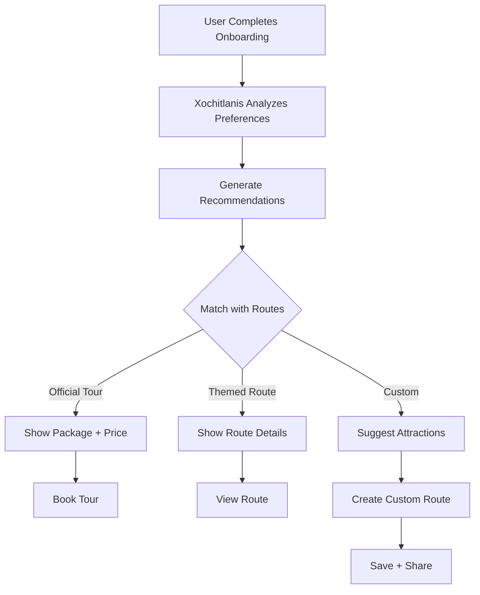

# Tourism Routes

The Zongolica Tourism platform supports both **official tour packages** and **user-created custom routes**. Users can create personalized itineraries, save them to their profile, and share them via unique codes.

<Note>
  Routes data is stored in Supabase (`user_routes` table) and can be shared via 10-character codes.
</Note>

## Route Types

<CardGroup cols={2}>
  <Card title="Official Tours" icon="map">
    3 official packages from Tourism Department with pricing
  </Card>
  <Card title="Themed Routes" icon="compass">
    Pre-designed routes: Express, Familia, El Porvenir
  </Card>
  <Card title="Custom Routes" icon="pen-to-square">
    User-created itineraries with selected attractions
  </Card>
  <Card title="Shared Routes" icon="share-nodes">
    Routes shared by other users via codes
  </Card>
</CardGroup>

## Route Interface

```typescript src/types/turismo.ts
export interface RutaTuristica {
  id: string;
  nombre: string;
  slug: string;
  descripcion: string;
  descripcionLarga: string[];
  insignia: string;
  color: string;
  colorSecundario: string;
  atractivos: string[];        // Array of attraction slugs
  duracion: string;
  dificultad: 'Baja' | 'Media' | 'Alta';
  distancia: string;
  tipo: string;
  incluye: string[];
  recomendaciones: string[];
  imagen: string;
  destacada: boolean;
}
```

## Official Tour Packages (3)

Official tours from the Tourism Department with fixed pricing:

### 1. Tour Huixtla (Route 1)

```typescript src/data/turismo/index.ts
{
  id: "tour-huixtla",
  nombre: "Tour Huixtla",
  descripcion: "Nacimiento del Río Tonto, Perfil del Cristo y Arco Natural Boquerón",
  atractivos: [
    "nacimiento-rio-tonto",
    "perfil-del-cristo",
    "arco-natural-boqueron"
  ],
  duracion: "4-8 horas",
  dificultad: "Alta",
  distancia: "31 km",
  tipo: "Aventura",
  incluye: [
    "Transporte",
    "Guías acreditados",
    "Snack",
    "Accesos",
    "Paseo en lancha",
    "Equipo homologado"
  ],
  destacada: true,
}
```

**Package Details:**
- **Price**: $750 MXN per person
- **Extras**: Caving +$500, Kayak +$500
- **Activities**: Caving, kayaking (3.5 km), boat ride
- **Minimum**: 4 people
- **Maximum**: 12 people

### 2. Tour Sótano Popócatl (Route 2)

```typescript src/data/turismo/index.ts
{
  id: "tour-sotano-popocatl",
  nombre: "Tour Sótano Popócatl",
  descripcion: "Descenso al Sótano del Popócatl y Cueva de Totomochapa",
  atractivos: [
    "sotano-del-popocatl",
    "cueva-de-totomochapa",
    "perfil-del-cristo"
  ],
  duracion: "6-8 horas",
  dificultad: "Alta",
  distancia: "33 km",
  incluye: [
    "Transporte",
    "Guías acreditados",
    "Snack",
    "Comida",
    "Equipo homologado"
  ],
}
```

**Package Details:**
- **Price**: $1,350 MXN per person
- **Activities**: 70m sótano descent, cave exploration
- **Minimum**: 4 people
- **Maximum**: 10 people
- **Age**: 16+ only

### 3. Tour Cascada Atlahuitzía (Route 3)

```typescript src/data/turismo/index.ts
{
  id: "tour-cascada-atlahuitzia",
  nombre: "Tour Cascada Atlahuitzía",
  descripcion: "Cascada de 120 metros y Mirador El Precipicio",
  atractivos: [
    "cascada-atlahuitzia",
    "mirador-el-precipicio"
  ],
  duracion: "4-5 horas",
  dificultad: "Media",
  distancia: "21 km",
  tipo: "Día completo",
  incluye: [
    "Transporte",
    "Guías acreditados",
    "Snack",
    "Equipo acuático"
  ],
}
```

**Package Details:**
- **Price**: $500 MXN per person
- **Minimum**: 4 people
- **Maximum**: 15 people
- **Family friendly**: Yes

## Themed Routes (3)

Pre-designed routes for specific experiences:

### Ruta Express Centro

```typescript src/data/turismo/index.ts
{
  id: "ruta-express",
  nombre: "Ruta Express Centro",
  descripcion: "Recorre lo esencial del centro de Zongolica en medio día",
  atractivos: [
    "parroquia-san-francisco-de-asis",
    "el-calvario",
    "estatua-cristo-rey",
    "la-pergola"
  ],
  duracion: "3-5 horas",
  dificultad: "Baja",
  distancia: "3 km aprox.",
  tipo: "Corta",
  incluye: ["Guía local", "Mapa impreso"],
  destacada: true,
}
```

Perfect for visitors with limited time, covering the downtown highlights.

### Ruta El Porvenir

```typescript
{
  id: "ruta-el-porvenir",
  nombre: "Ruta El Porvenir",
  atractivos: [
    "cueva-de-las-golondrinas",
    "exhacienda-de-los-gachupines",
    "sotano-del-gachupin"
  ],
  duracion: "6-8 horas",
  dificultad: "Alta",
  distancia: "26 km",
}
```

Explore the El Porvenir area with its unique combination of caves, ruins, and extreme descent.

### Ruta Familiar

```typescript
{
  id: "ruta-familiar",
  nombre: "Ruta Familiar",
  descripcion: "Experiencia segura y accesible para toda la familia",
  atractivos: [
    "parroquia-san-francisco-de-asis",
    "el-calvario",
    "estatua-cristo-rey",
    "perfil-del-cristo"
  ],
  duracion: "4-6 horas",
  dificultad: "Baja",
  tipo: "Familiar",
  recomendaciones: [
    "Apto para niños desde 4 años",
    "Snacks extra para niños",
    "Calzado cómodo"
  ],
}
```

Designed for families with children 4+. Safe, accessible, comfortable timing.

## User Routes Database

### UserRoute Interface

```typescript src/lib/supabase.ts
export interface UserRoute {
  id: string;
  user_id: string;
  user_name?: string;
  route_name: string;
  atractivos: string[];     // Array of attraction slugs
  ticket_url: string;       // Generated ticket URL
  share_code: string;       // Unique 10-char code
  badges: string[];         // Badge IDs earned
  created_at: string;
}
```

### Save User Route

```typescript src/lib/supabase.ts
export async function saveUserRoute(route: Omit<UserRoute, 'id' | 'created_at'>) {
  const { data, error } = await supabase
    .from('user_routes')
    .insert([route])
    .select()
    .single();
  return { data, error };
}
```

**Example:**

```typescript
import { saveUserRoute } from '@/lib/supabase';
import { generateShareCode } from '@/lib/generateTicket';

const shareCode = generateShareCode(); // "V1StGXR8_Z"

const route = {
  user_id: 'user-123',
  user_name: 'Juan Pérez',
  route_name: 'Mi Ruta Perfecta',
  atractivos: [
    'cascada-atlahuitzia',
    'parroquia-san-francisco-de-asis',
    'cristo-rey'
  ],
  ticket_url: `/ruta/${shareCode}`,
  share_code: shareCode,
  badges: ['primera_ruta'],
};

await saveUserRoute(route);
```

### Get Routes by User

```typescript src/lib/supabase.ts
export async function getUserRoutes(userId: string) {
  const { data, error } = await supabase
    .from('user_routes')
    .select('*')
    .eq('user_id', userId)
    .order('created_at', { ascending: false });
  return { data, error };
}
```

### Get Latest Route

```typescript src/lib/supabase.ts
export async function getLatestUserRoute(userId: string) {
  const { data, error } = await supabase
    .from('user_routes')
    .select('*')
    .eq('user_id', userId)
    .order('created_at', { ascending: false })
    .limit(1)
    .single();
  return data;
}
```

## Route Sharing System

Routes can be shared using unique 10-character codes:

### Generate Share Code

```typescript src/lib/generateTicket.ts
import { nanoid } from 'nanoid';

export function generateShareCode(): string {
  return nanoid(10);
}
```

### Get Route by Share Code

```typescript src/lib/supabase.ts
export async function getUserRoute(shareCode: string) {
  const { data, error } = await supabase
    .from('user_routes')
    .select('*, user:user_id(*)')
    .eq('share_code', shareCode)
    .single();
  return { data, error };
}
```

### Share URL Format

```
https://zongolica.gob.mx/turismo/ticket/V1StGXR8_Z
https://zongolica.gob.mx/ruta/V1StGXR8_Z
```

<Note>
  Share codes are **case-sensitive** and must be exactly 10 characters for security.
</Note>

## Creating a Custom Route

### Step 1: User Selects Attractions

```typescript
const selectedAttractions = [
  'cascada-atlahuitzia',
  'mirador-el-precipicio',
  'parroquia-san-francisco-de-asis',
];
```

### Step 2: Generate Share Code

```typescript
import { generateShareCode } from '@/lib/generateTicket';

const shareCode = generateShareCode();
// Example: "mT8qW2rL5p"
```

### Step 3: Save to Database

```typescript
import { saveUserRoute } from '@/lib/supabase';
import { getCurrentUser } from '@/lib/supabase';

const user = await getCurrentUser();

const route = {
  user_id: user.id,
  user_name: user.user_metadata.full_name,
  route_name: 'Mi Ruta del Fin de Semana',
  atractivos: selectedAttractions,
  ticket_url: `/ruta/${shareCode}`,
  share_code: shareCode,
  badges: ['primera_ruta'],
};

const { data, error } = await saveUserRoute(route);
```

### Step 4: Generate Ticket

```typescript
const response = await fetch('/api/turismo/ticket', {
  method: 'POST',
  headers: { 'Content-Type': 'application/json' },
  body: JSON.stringify({
    name: user.user_metadata.full_name,
    email: user.email,
    shareCode,
  }),
});

const { ticketUrl } = await response.json();
window.location.href = ticketUrl;
```

### Step 5: Share with Friends

Users can share via:
- **QR Code**: Scanned at attractions
- **URL**: Copy and paste
- **Social Media**: WhatsApp, Facebook, Twitter

## Route Badges

Creating routes unlocks badges:

```typescript src/lib/badges.ts
primer_ruta: {
  id: 'primera_ruta',
  name: 'Primera Ruta',
  description: '¡Creaste tu primera ruta personalizada!',
  icon: '🗺️',
  color: 'from-green-400 to-emerald-400',
  unlockType: 'action',
}
```

<CardGroup cols={2}>
  <Card title="Primera Ruta" icon="map">
    Unlocked when creating first custom route
  </Card>
  <Card title="Explorador" icon="compass">
    Visit 5 places (tracked via routes)
  </Card>
  <Card title="Veterano" icon="trophy">
    Visit 10 places
  </Card>
  <Card title="Leyenda" icon="crown">
    Visit all 17 attractions
  </Card>
</CardGroup>

## Query Routes

```typescript
import { rutasTuristicas } from '@/data/turismo/index';

// Get all routes
const all = rutasTuristicas; // 6 routes

// Get official tours only
const official = rutasTuristicas.filter(r => 
  r.id.startsWith('tour-')
);

// Get featured routes
const featured = rutasTuristicas.filter(r => r.destacada);

// By difficulty
const easy = rutasTuristicas.filter(r => r.dificultad === 'Baja');
const adventure = rutasTuristicas.filter(r => r.dificultad === 'Alta');

// By slug
const route = rutasTuristicas.find(r => r.slug === 'tour-huixtla');
```

## Route Recommendation Flow



## Route Stats

| Route | Duration | Distance | Difficulty | Price |
|-------|----------|----------|------------|-------|
| Tour Huixtla | 4-8 h | 31 km | Alta | $750 |
| Tour Popócatl | 6-8 h | 33 km | Alta | $1,350 |
| Tour Atlahuitzía | 4-5 h | 21 km | Media | $500 |
| Ruta Express | 3-5 h | 3 km | Baja | Free |
| Ruta Porvenir | 6-8 h | 26 km | Alta | Varies |
| Ruta Familiar | 4-6 h | 5 km | Baja | Free |

## Related Pages

<CardGroup cols={2}>
  <Card title="Attractions" icon="map-pin" href="/tourism/attractions">
    All 17 attractions with details
  </Card>
  <Card title="Tickets" icon="ticket" href="/tourism/tickets">
    Generate shareable tickets
  </Card>
  <Card title="Badges" icon="award" href="/tourism/badges">
    Unlock badges by visiting
  </Card>
  <Card title="Recommendations" icon="sparkles" href="/tourism/recommendations">
    AI-powered route suggestions
  </Card>
</CardGroup>